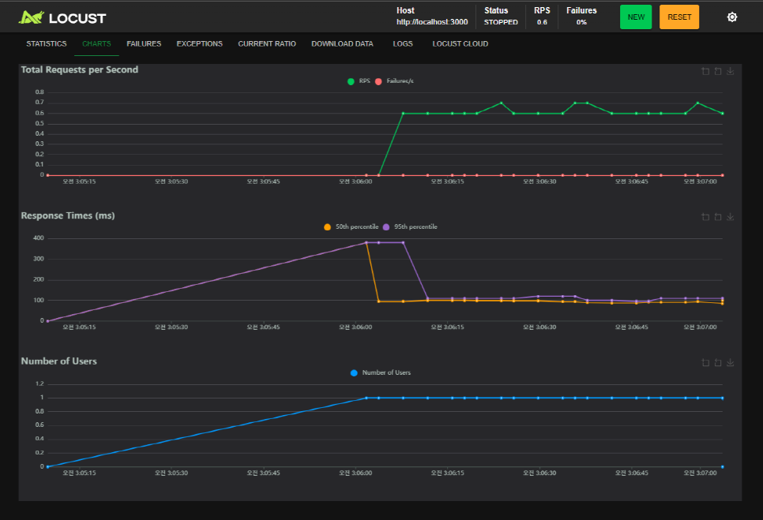

# ✨ Ruby on Rails における並列処理の実装と設計

## 🧠 並列処理とは？

複数の処理を同時に実行することで、全体の処理時間を短縮する技術です。  順次処理（一つずつ実行）と異なり、複数のCPUコアを同時に活用することで高速化が可能です。

例：ユーザーごとの進捗集計を同時に処理することで、処理全体を効率化できる

> 🤔 処理速度向上 /システム負荷が増加する可能性あり

## 🛠 Rubyで並列処理を行う方法（3種類）
１.　Thread：Ruby標準のスレッド機能。基本的な並列処理が可能

２.　Parallel gem：シンプルで直感的。ループ処理の並列化に特化（本プロジェクトで使用）

３.　Sidekiq： 非同期ジョブキュー方式。実務では最も使用されている


## 並列処理が有効なケース

- APIで複数データを一括取得 ：ネットワーク待ち時間の短縮 
- Rakeタスクで大量集計処理 ： 実行時間を大幅に短縮可能 
- CSVなどの大規模データ処理 ： 同時読み込み・保存の高速化 

## ⚠️ 並列処理時のログ出力について

本バッチ処理では、ユーザー単位での集計結果を `puts` で出力していますが、  並列処理ではこの出力がボトルネック(Bottleneck) になる可能性があります。

### 対策案

- `Rails.logger.info` などで出力レベルを調整
- 配列にログを蓄積して後で一括出力することで改善可能

##  処理方式比較：Rake vs サービスメソッド

| 項目 | `system("bundle exec rake ...")` | `TaskProgressAggregator.run(...)` |
|:---|:---|:---|
| 実行方法 | 外部シェルコマンド | Rails内部で直接メソッド呼び出し |
| パフォーマンス | 遅い（環境を一から立ち上げる） | 速い（現在のプロセスをそのまま使用） |
| エラーハンドリング | `true/false` のみ判定可 | `rescue` で例外処理が可能 |
| 戻り値 | なし（nil） | あり（任意の値を返却可能） |
| ログ制御 | puts出力のみ | logger・CSV出力・JSON整形可能 |
| テスト容易性 | 単体テスト不可 | RSpecなどでテスト可能 |

## 📂全体処理フロー（Vue / API / Locust）

```bash
[Vueボタン / Locustリクエスト]
   ↓
[POST /api/v1/task_progresses/recalculate]
   ↓
[コントローラーでパラメータ受け取り]
   ├─ parallel: false → 順次処理
   └─ parallel: true  → 並列処理（Parallel.each）
   ↓
[TaskProgressAggregator.run(...) 実行]
   ↓
[タスク進捗率を計算 → TaskProgressへ保存]
   ↓
[ログ記録 or API応答完了]
```

## 🧪 Locust テスト（locustfile.py）
- /recalculate API に対して parallel: true/false の両方をランダムに送信
- 並列処理と順次処理の性能差を定量的に比較できる
- locust -f locustfile.py --host http://localhost:3000 で実行


## 📦 まとめ
| 呼び出し元 | 処理タイプ | 備考|
|:---|:---|:---|
| Vue + API | 順次処理| ユーザー操作の安定性を優先 |
| Rakeタスク| 並列処理| バッチ・性能比較用|
| Locust| 両方ランダム| ベンチマーク用途|
