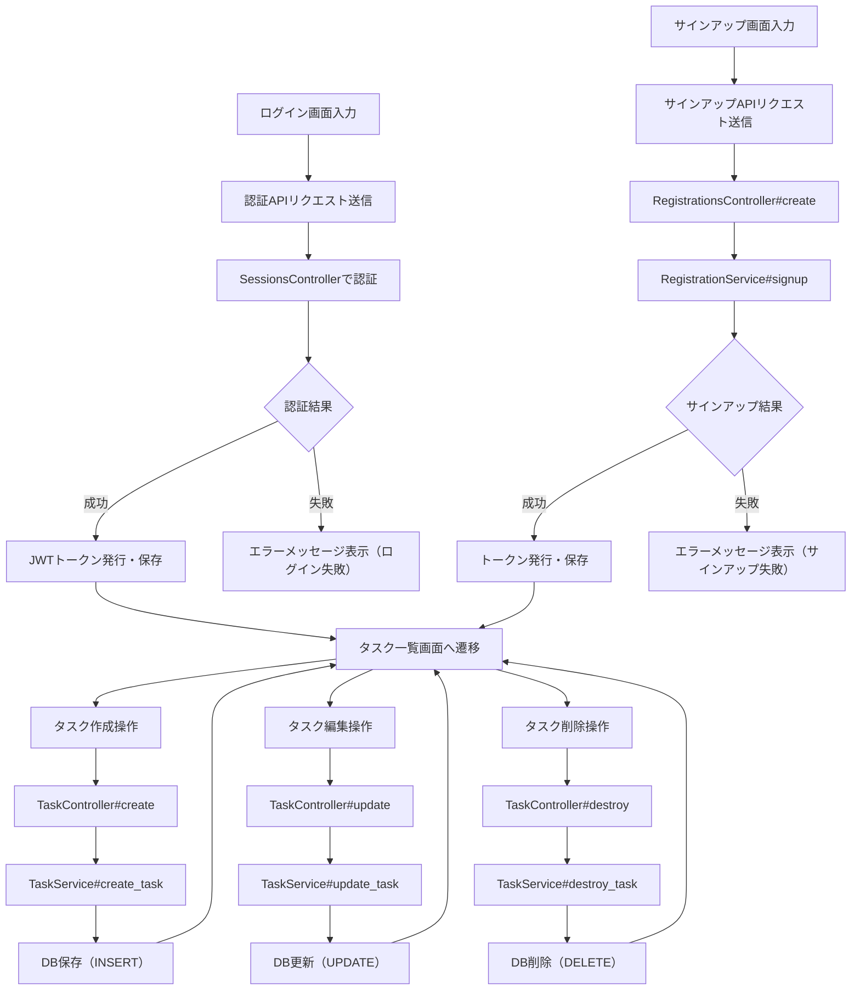

# Team Task Manager 全体フロー

---

```mermaid
flowchart TD
    %% ログイン・サインアップ入口
    A1[ログイン画面入力] --> B1[認証APIリクエスト送信]
    A2[サインアップ画面入力] --> B2[サインアップAPIリクエスト送信]

    %% 認証処理
    B1 --> C1[SessionsControllerで認証]
    B2 --> C2[RegistrationsController#create]
    C2 --> C2S[RegistrationService#signup]

    %% 認証結果分岐
    C1 --> D1{認証結果}
    D1 -- 成功 --> E1[JWTトークン発行・保存]
    D1 -- 失敗 --> F1[エラーメッセージ表示（ログイン失敗）]

    C2S --> D2{サインアップ結果}
    D2 -- 成功 --> E2[トークン発行・保存]
    D2 -- 失敗 --> F2[エラーメッセージ表示（サインアップ失敗）]

    %% タスク一覧画面へ遷移
    E1 --> G1[タスク一覧画面へ遷移]
    E2 --> G1

    %% タスク操作
    G1 --> H1[タスク作成操作]
    G1 --> H2[タスク編集操作]
    G1 --> H3[タスク削除操作]

    %% タスクAPI(Controller)呼び出し
    H1 --> I1[TaskController#create]
    H2 --> I2[TaskController#update]
    H3 --> I3[TaskController#destroy]

    %% タスクAPI(Service)呼び出し
    I1 --> J1[TaskService#create_task]
    I2 --> J2[TaskService#update_task]
    I3 --> J3[TaskService#destroy_task]


    %% DB操作
    J1 --> K1[DB保存（INSERT）]
    J2 --> K2[DB更新（UPDATE）]
    J3 --> K3[DB削除（DELETE）]

    %% タスク一覧再反映
    K1 --> G1
    K2 --> G1
    K3 --> G1
```
