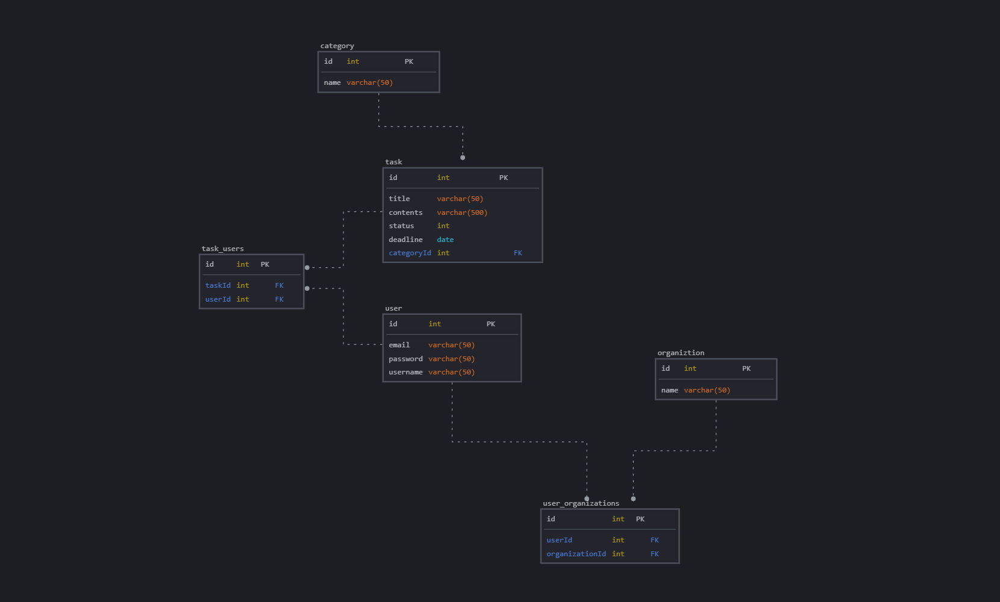

# モデル設計書

## テーブル・カラム・リレーション構成

| テーブル名 | 主キー | カラム名 | データ型 | 外部キー | 説明 | リレーション | 
|:---|:---|:---|:---|:---|:---|:---|
| user | id | email | string | なし | メールアドレス | user_organizations, task_users と関連 | 
|  |  | password | string | なし | パスワード |  | 
|  |  | username | string | なし | ユーザー名 |  | 
| organization | id | name | string | なし | 組織名 | user_organizations と関連 | 
| user_organizations | id | userId | int | user(id) | ユーザーID | users と organizations を中間テーブルで関連 | 
|  |  | organizationId | int | organization(id) | 組織ID |  | 
| task | id | title | string | なし | タスクタイトル | task_users, categories と関連 | 
|  |  | contents | string | なし | タスク内容 |  | 
|  |  | status | int | なし | タスクステータス（開始前/進行中/完了） |  | 
|  |  | due_date | date | なし | 締切日 |  | 
|  |  | category | string | なし | カテゴリーID |  | 
|  |  | organization_id | int | organizations(id) | 所属組織 |  |
| task_users | id | taskId | int | task(id) | タスクID | tasks と users を中間テーブルで関連 | 
|  |  | userId | int | user(id) | ユーザーID |  | 
| category | id | name | string | なし | カテゴリー名 | taskと関連 | 
| task_progresses | id | user_id | int | users(id) | 担当者ID | task数・完了数・進捗率を保存 | 
|  |  | workspace_id | int | organizations(id) | 組織ID |  | 
|  |  | total_tasks | int | なし | 全タスク数 |  | 
|  |  | completed_tasks | int | なし | 完了タスク数 |  | 
|  |  | progress_rate | decimal | なし | 進捗率（0.00〜1.00） |  |