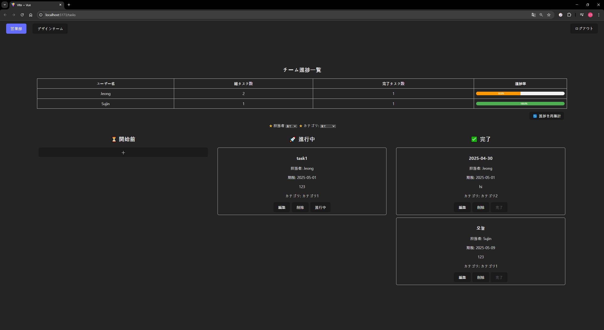

# ログイン画面仕様書

| No | 項目名 | 表示名 | I/O | オブジェクト | DBマッピング | エラー処理 | 備考 |
| --- | --- | --- | --- | --- | --- | --- | --- |
| 1 | タイトル | Login | 出力 | text |  |  | ページタイトル |
| 2 | メールアドレス | メールを入力してください。 | 入力 | input(email) | user.email | 未入力時：「メールアドレスを入力してください。」 |  |
| 3 | パスワード | パスワードを入力してください。 | 入力 | input(password) | user.password | 未入力時：「パスワードを入力してください。」 |  |
| 4 | ボタン | ログイン | 出力 | button | ‐ | 認証失敗時：「メールアドレスまたはパスワードが間違っています。」 | 押下時にログイン処理を実施 |
| 5 | リンク | サインアップ | 出力 | link | ‐ |  | サインアップ画面へ遷移（　/signup　）  |

# サインアップ画面仕様書

| No | 項目名 | 表示名 | I/O | オブジェクト | DBマッピング | エラー処理 | 備考 |
| --- | --- | --- | --- | --- | --- | --- | --- |
| 1 | タイトル | Sign up | 出力 | text |  |  | ページタイトル |
| 2 | 名前 | 名前を入力してください。 | 入力 | input(text) | user.name | 未入力時：「名前を入力してください。」 |  |
| 3 | メールアドレス | メールを入力してください。 | 入力 | input(email) | user.email | 未入力時：「メールアドレスを入力してください。」 |  |
| 4 | パスワード | パスワードを入力してください。 | 入力 | input(password) | user.password | 未入力時：「パスワードを入力してください。」 |  |
| 5 | チェックボックス | 組織名を選択 | 入力 | checkbox | user_organizations.organizationId | 選択しない場合：エラーなし（任意選択なら） | 複数選択可 |
| 6 | サインアップボタン | サインアップ | 出力 | button |  | 入力エラーがある場合はボタン無効またはエラーメッセージ表示 | 登録処理実行 |

# タスク一覧画面仕様書

| No | 項目名 | 表示名 | I/O | オブジェクト | DBマッピング | エラー処理 | 備考 |
| --- | --- | --- | --- | --- | --- | --- | --- |
| 1 | タイトル | タスク一覧画面 | 出力 | text |  |  | ページタイトル |
| 2 | フィルター（担当者） | 担当者選択 | 入力 | select box | user_id |  | 全担当者リストから選択 |
| 3 | フィルター（カテゴリ） | カテゴリ選択 | 入力 | select box | category_id |  | 全カテゴリリストから選択 |
| 4 | セクションタイトル | 開始前／進行中／完了 | 出力 | text | task.status |  | ステータスごとにタスクを分類表示 |
| 5 | タスクカードタイトル | タスクタイトル | 出力 | text | task.title |  | タスクごとに個別表示 |
| 6 | タスクカード担当者 | 担当者名リスト | 出力 | text | task.userIds → user.name |  | 複数担当者可能 |
| 7 | タスクカード締切日 | 締切日 | 出力 | text | task.dueDate |  | yyyy-mm-dd形式 |
| 8 | タスクカード内容 | 内容 | 出力 | text | task.contents | - | タスクの詳細説明 |
| 9 | タスクカードカテゴリ | カテゴリ | 出力 | text | task.category |  |  |
| 10 | 編集ボタン | 編集 | 出力 | button |  |  | クリック時、編集モーダル表示 |
| 11 | 削除ボタン | 削除 | 出力 | button |  |  | クリック時、削除確認モーダル表示 |
| 12 | ステータス変更ボタン | 開始前→進行中→完了 | 出力 | button |  |  | クリックでステータス遷移 |
| 13 | ログアウトボタン | ログアウト | 出力 | button |  |  | クリック時、localStorageのtokenとuser情報を削除し、/loginに遷移 |
| 14 | チーム進捗表 | チーム進捗一覧 | 出力 | table | task_progresses |  | ユーザーごとに進捗率を可視化 |
| 15 | 進捗率バー | 進捗率 | 出力  | bar |  |  | (完了タスク数/総タスク数)*100 |
| 16 | 進捗率再集計ボタン | 進捗を再集計 | 出力  | button |  |  | Rakeタスク起動（API経由） |